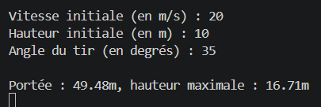
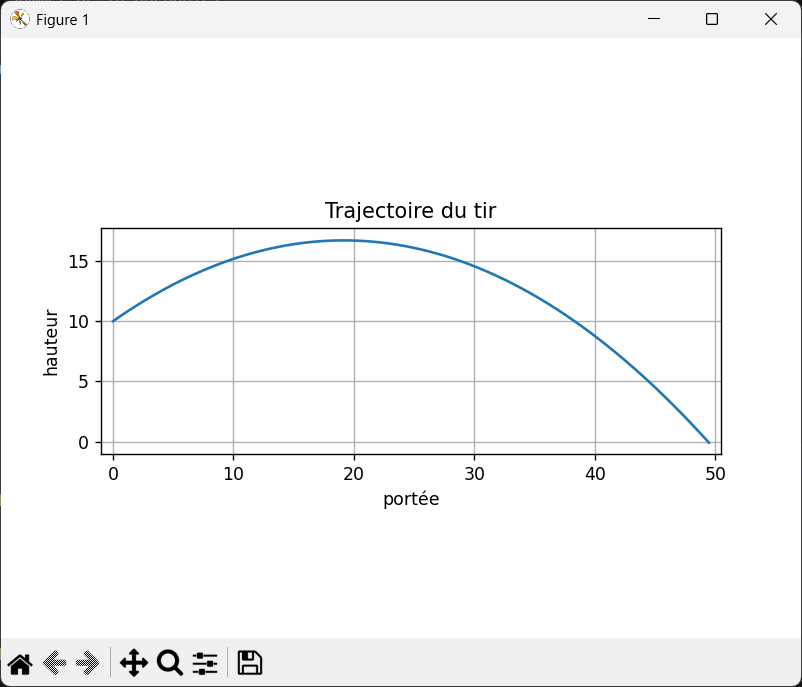

# Simulateur de tir parabolique sans frottements

**tir-parabolique.py** est un simulateur de **tir parabolique sans frottements** codé en python.  
Il fonctionne entièrement dans la console et ne nécessite aucune compétences particulière.

---

## Fonctionnalités

- Le programme récupère les **conditions initiales** (vitesse, hauteur et angle du tir) choisies par l'utilisateur grâce à des *input*.
- Ces données sont injectées dans les **équations horaires du mouvement parabolique**
- Le programme renvoie la **hauteur maximale** atteinte par le projectile, la **portée du tir** et trace une **courbe représentant la trajectoire du projectile**.

---

## Utilisation et Prérequis

Le seul prérequis pour utiliser le programme est d'installer la bibliothèque matplotlib (avec la commande *pip install matplotlib* ou *pip install -r requirements.txt*) et utiliser Python 3.10 ou ultérieur (pour la compatibilité avec matplotlib).  

Pour faire fonctionner le programme il suffit de lancer le code contenu dans le fichier *tir-parabolique.py*, la suite se passe dans la console.

---

## Exemples de résultats

---

## Structure du code

- *tir-parabolique.py* -> Code du programme en python
- *README.md* -> README (document de présentation) en markdown
- *requirements.txt* -> Fichier contenant les dépendances
- *screenshots* -> Dossier contenant les captures d'écrans

---

## Améliorations possibles

- Comparer plusieurs tirs sur le même graphique
- Ajouter une animation du projectile